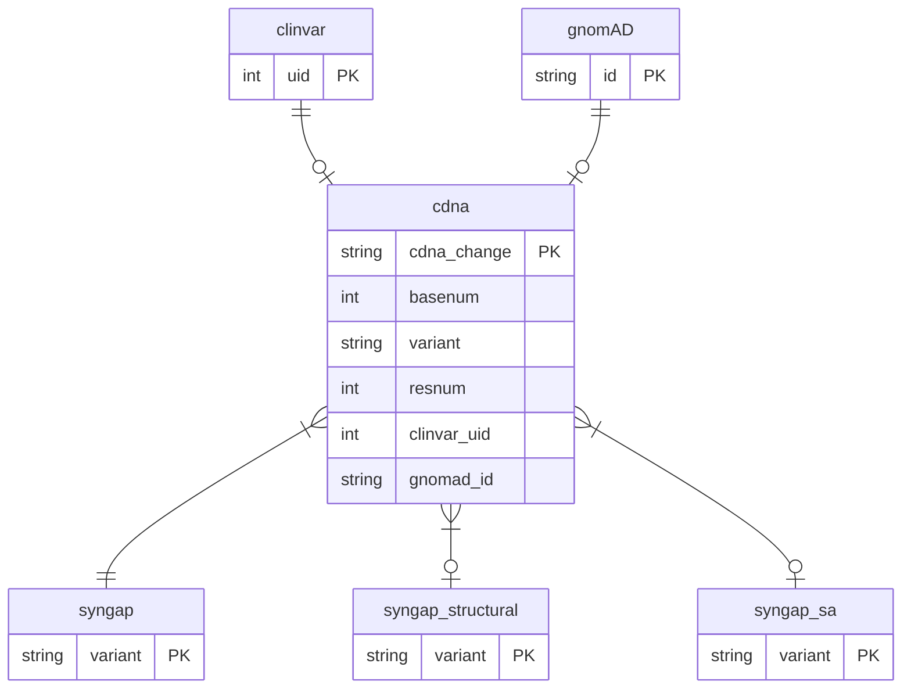

# SGM_schema
Schema for MariaDB database that has pathogenicity predictions for a gene

The 'cdna' could be considered the main table; one entry per unique c.dna change (aka HGVSc).
Each c.dna change may have data in ClinVar and gnomAD databases. A 'variant' is observed change
in protein sequence (HGVSp) that affects how the change affects protein.

The 'syngap' and 'syngap_structural' tables hold collected or computed predictions about variants.
The name "syngap" is due to the schema being created originally to store data for SYNGAP1 gene
(synaptic Ras GTPase activating protein 1).


```
+----------------------+
| Tables_in_syngap     |
+----------------------+
| AF_Q96PV0_F1_hg38    |
| ai_summary           |
| aminoacids           |
| cdna                 |
| clinvar              |
| clinvar_germline     |
| clinvar_review       |
| gnomAD               |
| predictions          |
| iupred2a             |
| mobidb               |
| phosphositeplus      |
| predictions          |
| psmutpred            |
| syngap               |
| syngap_domain        |
| syngap_sa            |
| syngap_structural    |
| syngap_verdict       |
| updated              |
+----------------------+
```
The aminoacids, clinvar_germline, clinvar_review, predictions, syngap_domain, syngap_verdict, and updated are (code->text) lookup tables.

```
+----------------------+
| Views_in_syngap      |
+----------------------+
| HGVSp_to_variant     |
| cdna_count           |
| for_HGVSp_to_variant |
| for_csv              |
| for_datatable        |
+----------------------+
```
The for_csv and for_datatable are views that combine/collect data for single CSV table and for display on SGM website, respectively.



Joins that are used:
```
FROM cdna
LEFT JOIN clinvar           ON cdna.clinvar_uid = clinvar.uid
LEFT JOIN clinvar_review    ON clinvar.review_status = clinvar_review.status
LEFT JOIN clinvar_germline  ON clinvar.germline_desc = clinvar_germline.cv_description
LEFT JOIN gnomAD            ON cdna.gnomad_id  = gnomAD.id
LEFT JOIN syngap            ON cdna.variant = syngap.variant
LEFT JOIN syngap_structural ON cdna.variant = syngap_structural.variant
LEFT JOIN syngap_sa         ON cdna.variant = syngap_sa.variant
LEFT JOIN psmutpred         ON cdna.variant = psmutpred.variant
LEFT JOIN iupred2a          ON cdna.resnum  = iupred2a.resnum
LEFT JOIN mobidb            ON cdna.resnum  = mobidb.resnum
LEFT JOIN phosphositeplus   ON cdna.resnum  = phosphositeplus.resnum
LEFT JOIN ai_summary        ON cdna.cdna_change = ai_summary.cdna_change
LEFT JOIN syngap_domain     ON syngap.domainID     = syngap_domain.domainID
LEFT JOIN syngap_verdict    ON syngap_sa.verdictID = syngap_verdict.verdictID
```

## Installation
* 'tables.sql' has the tables
* 'functions.sql' adds functions that create verbal predictions for scores
* 'views.sql' adds views/queries that combine columns for "single tables".
  Views depend on functions and tables

Create preferably two SQL users, one with write access and second with read-only.
Use the first for content updates and the second on website that shows content to public.
