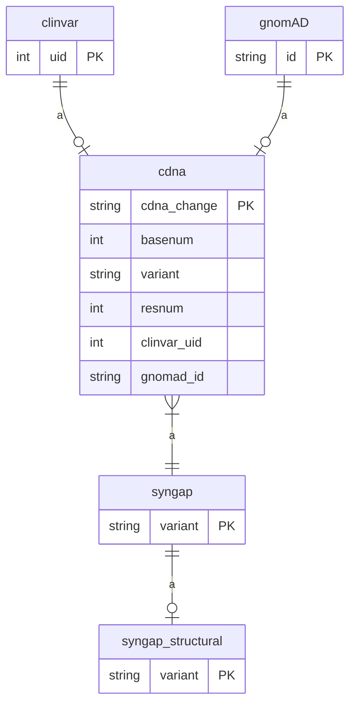

# SGM_schema
Schema for MariaDB database that has pathogenicity predictions for a gene

```
+----------------------+
| Tables_in_syngap     |
+----------------------+
| aminoacids           |
| cdna                 |
| clinvar              |
| clinvar_germline     |
| clinvar_review       |
| gnomAD               |
| syngap               |
| syngap_domain        |
| syngap_structural    |
| syngap_verdict       |
+----------------------+
```

```
+----------------------+
| Views_in_syngap      |
+----------------------+
| HGVSp_to_variant     |
| cdna_count           |
| for_HGVSp_to_variant |
| for_csv              |
| for_datatable        |
+----------------------+
```



## Installation
* 'tables.sql' has the tables
* 'functions.sql' adds functions that create verbal predictions for scores
* 'views.sql' adds views/queries that combine columns for "single tables".
  Views depend on functions and tables
